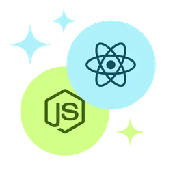

<h1 align="center"> 
   
  Projeto Webhook Inspector
</h1>

Projeto desenvolvido como parte do desafio **Full-Stack com IA na Prática** da [Rocketseat](https://www.rocketseat.com.br/).

## 🔍 Visão do Projeto  

A Webhook Inspector API permite registrar, armazenar e analisar webhooks recebidos, oferecendo um endpoint simples para captura e um painel de documentação via Swagger.  
Esse projeto demonstra a integração entre desenvolvimento full-stack e inteligência artificial/ferramentas modernas, alinhado com os aprendizados do desafio.

## 🛠️ Tecnologias Utilizadas

- **Backend**: [Fastify](https://www.fastify.io/)  
- **ORM**: [Drizzle ORM](https://orm.drizzle.team/) com PostgreSQL  
- **Tipagem/Validação**: [Zod](https://zod.dev/) + Fastify TypeProvider Zod  
- **Documentação de API**: @fastify/swagger + @scalar/fastify-api-reference  
- **Banco de dados**: PostgreSQL (via Docker)  
- **Gerenciamento de pacotes**: pnpm  
- **Ambiente de execução**: TypeScript + tsx

## 🚀 Como executar o projeto

### Pré-requisitos

Antes de começar, você vai precisar ter instalado em sua máquina as seguintes ferramentas:

